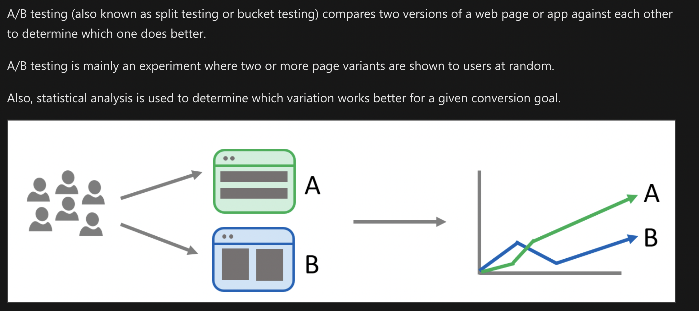
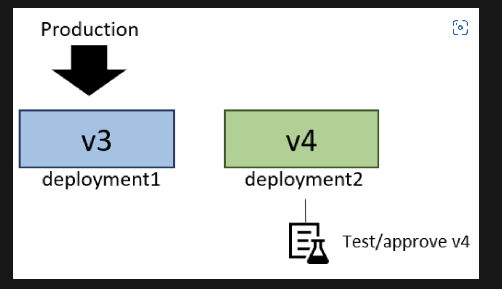
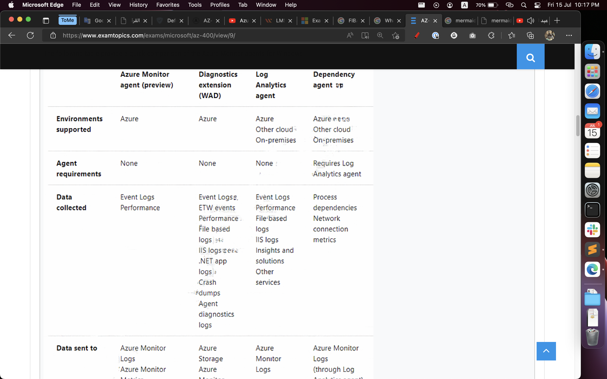
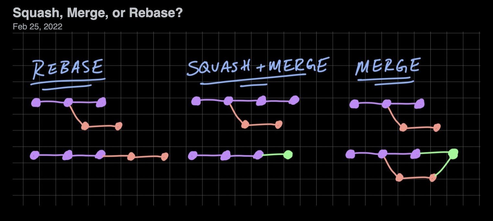
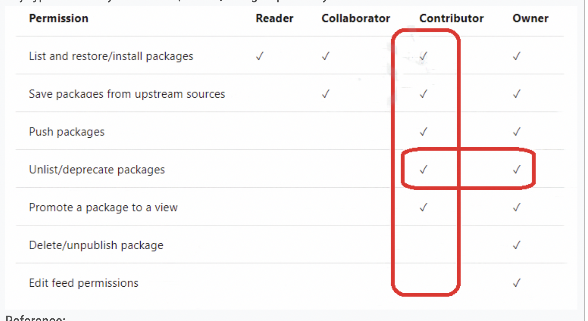
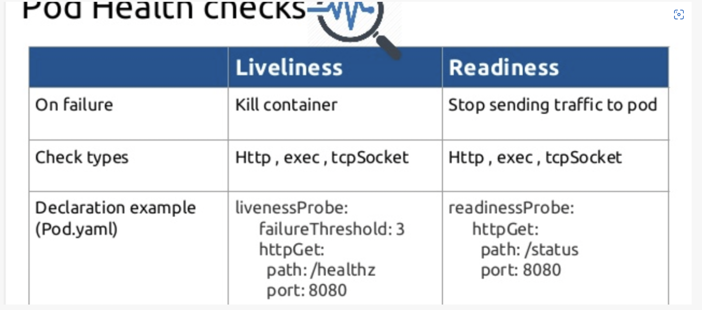
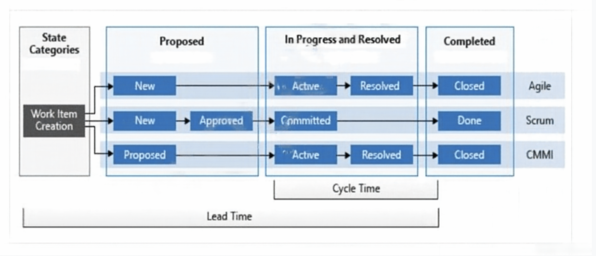

# AZ-400


Devops azure pipeline

- Tires
- [Artifacts](https://docs.microsoft.com/en-us/azure/devops/pipelines/artifacts/artifacts-overview?view=azure-devops&tabs=nuget)

- Plan a/b



- Deployment strategy (green/blue, feature deplyment, range deployment)

---

Containers & AKS (Kuberneters)

- Mircoservice 


---

Diff between pipeline vs real vs arficat in Azure Devops

---

SonarQube : code coverage test,

WhiteSource Bolt : security alerts on your open source dependencies

--- 



---

Squash merging : 



Squash merging is a merge option that allows you to condense the Git history of topic branches when you complete a pull request. Instead of each commit on the
topic branch being added to the history of the default branch, a squash merge takes all the file changes and adds them to a single new commit on the default
branch. A simple way to think about this is that squash merge gives you just the file changes, and a regular merge gives you the file changes and the commit
history. Note: Squash merging keeps your default branch histories clean and easy to follow without demanding any workflow changes on your team. Contributors
to the topic branch work how they want in the topic branch, and the default branches keep a linear history through the use of squash merges. The commit history
of a master branch updated with squash merges will have one commit for each merged branch. You can step through this history commit by commit to find out
exactly when work was done.

---



---

Azure key -> access (Get, list)

---

Cherry pick for pull-request in Git

---

Technical depit

---

AKS Readness V.S Liveness



---

Work Strategy



---

Helm K8S

```
Image result for Helm
Helm is a Kubernetes deployment tool for automating creation, packaging, configuration, and deployment of applications and services to Kubernetes clusters. Kubernetes is a powerful container-orchestration system for application deployment
```

---

[managed identities](https://docs.microsoft.com/en-us/azure/active-directory/managed-identities-azure-resources/overview)

---

Upstream sources
Include packages from common public sources


### SIMULATION


- https://www.examtopics.com/exams/microsoft/az-400/view/4/
	Question #7

- https://www.examtopics.com/exams/microsoft/az-400/view/5/
	Question #15, #16, #17

- https://www.examtopics.com/exams/microsoft/az-400/view/7/
	Question #9

- https://www.examtopics.com/exams/microsoft/az-400/view/14/
	Question #47

- https://www.examtopics.com/exams/microsoft/az-400/view/12/
	Question #32, 

- https://www.examtopics.com/exams/microsoft/az-400/view/11/
	Question #14, #15

- https://www.examtopics.com/exams/microsoft/az-400/view/10/
	Question #8
	

### Wrong Answer

- Other/microsoft.testkings.az-400.exam.dumps.2022-jan-09.by.adrian.142q.vce.pdf
	Page: 3, 5, 7, 9, 11, 16
	
- microsoft.2passeasy.az-400.pdf.exam.2022-jan-16.by.bob.108q.vce.pdf
	Page: 5, 8, 10

- https://www.examtopics.com/exams/microsoft/az-400/view/1/
	3
- https://www.examtopics.com/exams/microsoft/az-400/view/2/
	20
- https://www.examtopics.com/exams/microsoft/az-400/view/3/
	24
- https://www.examtopics.com/exams/microsoft/az-400/view/5/
	14
- https://www.examtopics.com/exams/microsoft/az-400/view/6/
	22, 1, 24, 2      1
- https://www.examtopics.com/exams/microsoft/az-400/view/16/
	11, 15            11
- https://www.examtopics.com/exams/microsoft/az-400/view/15/
	10
- https://www.examtopics.com/exams/microsoft/az-400/view/14/
	51, 48
- https://www.examtopics.com/exams/microsoft/az-400/view/13/
	38, 36
- https://www.examtopics.com/exams/microsoft/az-400/view/12/
	24, 28
- https://www.examtopics.com/exams/microsoft/az-400/view/11/
	17, 18
- https://www.examtopics.com/exams/microsoft/az-400/view/10/
	13	
- https://www.examtopics.com/exams/microsoft/az-400/view/9/
	26
- https://www.examtopics.com/exams/microsoft/az-400/view/8/
	15, 13
- https://www.examtopics.com/discussions/microsoft/view/17259-exam-az-400-topic-13-question-3-discussion/

- https://www.freecram.net/question/Microsoft.AZ-400.v2022-03-30.q190/you-have-an-azure-subscription-that-contains-a-resources-group-named-rg1-rg1-contains-the-following   1

- https://www.freecram.net/question/Microsoft.AZ-400.v2022-03-30.q190/you-have-a-protect-in-azure-devops-you-need-to-associate-an-automated-test-to-a-test-case-which-three

- https://www.freecram.net/question/Microsoft.AZ-400.v2022-03-30.q190/you-are-deploying-a-new-application-that-uses-azure-virtual-machines-you-plan-to-use-the-desired-state

- https://www.freecram.net/question/Microsoft.AZ-400.v2022-03-30.q190/you-are-creating-a-build-pipeline-in-azure-pipelines-you-define-several-tests-that-might-fail-due-to

- https://www.freecram.net/question/Microsoft.AZ-400.v2022-03-30.q190/you-need-to-configure-authentication-for-app1-the-solution-must-support-the-planned-changes-which-three   1

- https://www.freecram.net/question/Microsoft.AZ-400.v2022-03-30.q190/as-part-of-your-application-build-process-you-need-to-deploy-a-group-of-resources-to-azure-by-using      1

- https://www.freecram.net/question/Microsoft.AZ-400.v2022-03-30.q190/you-have-a-project-in-azure-devops-that-uses-packages-from-multiple-public-feeds-some-of-the-feeds-are

- https://www.freecram.net/question/Microsoft.AZ-400.v2022-03-30.q190/your-company-has-60-developers-who-are-assigned-to-four-teams-each-team-has-15-members-the-company

- https://www.freecram.net/question/Microsoft.AZ-400.v2022-03-30.q190/you-have-an-azure-subscription-that-contains-a-resources-group-named-rg1-rg1-contains-the-following-167

- https://www.freecram.net/question/Microsoft.AZ-400.v2022-07-19.q125/you-are-configuring-the-settings-of-a-new-git-repository-in-azure-repos-you-need-to-ensure-that-pull

- https://www.freecram.net/question/Microsoft.AZ-400.v2022-07-19.q125/you-are-designing-a-strategy-to-monitor-the-baseline-metrics-of-azure-virtual-machines-that-run-windows

- https://www.freecram.net/question/Microsoft.AZ-400.v2022-07-19.q125/you-have-an-azure-subscription-that-contains-the-resources-shown-in-the-following-table-exhibit-you

- https://www.freecram.net/question/Microsoft.AZ-400.v2022-07-19.q125/you-are-creating-a-yaml-based-azure-pipeline-to-deploy-an-azure-data-factory-instance-that-has-the-followi

- https://www.freecram.net/question/Microsoft.AZ-400.v2022-07-19.q125/you-are-deploying-a-server-application-that-will-run-on-a-server-core-installation-of-windows-server

- https://www.freecram.net/question/Microsoft.AZ-400.v2022-07-19.q125/you-have-azure-pipelines-and-github-integrated-as-a-source-code-repository-the-build-pipeline-has-continu

- https://www.freecram.net/question/Microsoft.AZ-400.v2022-07-19.q125/after-you-answer-a-question-in-this-section-you-will-not-be-able-to-return-to-it-as-a-result-these

- https://www.freecram.net/question/Microsoft.AZ-400.v2022-07-19.q125/you-use-github-for-source-control-and-project-related-discussions-you-receive-a-notification-when-an

- https://www.freecram.net/question/Microsoft.AZ-400.v2022-07-19.q125/you-need-to-configure-authentication-for-app1-the-solution-must-support-the-planned-changes-which-three

- https://www.freecram.net/question/Microsoft.AZ-400.v2022-04-04.q115/you-have-a-private-distribution-group-that-contains-provisioned-and-unprovisioned-devices-you-need-to-88

- https://www.freecram.net/question/Microsoft.AZ-400.v2022-04-04.q115/you-are-deploying-a-new-application-that-uses-azure-virtual-machines-you-plan-to-use-the-desired-state

- https://www.freecram.net/question/Microsoft.AZ-400.v2022-04-04.q115/you-plan-to-use-desired-state-configuration-dsc-to-maintain-the-configuration-state-of-virtual-machines

- https://www.freecram.net/question/Microsoft.AZ-400.v2022-04-04.q115/you-haw-an-azure-subscription-that-contains-multiple-azure-services-you-need-to-send-an-sms-alert-when

- https://www.freecram.net/question/Microsoft.AZ-400.v2022-04-04.q115/note-this-question-is-part-of-a-series-of-questions-that-present-the-same-scenario-each-question-in-57    1

- https://www.freecram.net/question/Microsoft.AZ-400.v2022-07-19.q125/you-have-an-azure-devops-project-that-contains-a-release-pipeline-and-a-git-repository-when-a-new-code

- https://www.freecram.net/question/Microsoft.AZ-400.v2022-07-19.q125/you-have-an-azure-devops-organization-named-contoso-and-an-azure-subscription-the-subscription-contains

- https://www.freecram.net/question/Microsoft.AZ-400.v2022-07-19.q125/you-have-a-protect-in-azure-devops-you-need-to-associate-an-automated-test-to-a-test-case-which-three

- https://www.freecram.net/question/Microsoft.AZ-400.v2022-07-19.q125/you-have-a-project-in-azure-devops-you-plan-to-deploy-a-self-hosted-agent-by-using-an-unattended-configur   1

- https://www.freecram.net/question/Microsoft.AZ-400.v2022-07-19.q125/you-have-an-azure-devops-organization-named-contoso-and-an-azure-subscription-you-use-azure-devops-to    1 1

- https://www.freecram.net/question/Microsoft.AZ-400.v2022-07-19.q125/you-have-a-private-distribution-group-that-contains-provisioned-and-unprovisioned-devices-you-need-to-123  1

- https://www.freecram.net/question/Microsoft.AZ-400.v2022-07-19.q125/you-are-configuring-the-azure-devops-dashboard-the-solution-must-meet-the-technical-requirements-which


### Resourcies

- [Azure Automation](https://www.google.com/search?q=azure+automation&oq=azure+automation&aqs=edge..69i57j0i512l7j69i64.5020j0j1&sourceid=chrome&ie=UTF-8#bsht=CgRmYnNtEgQIBBAA)

- [Application Insights overview](https://docs.microsoft.com/en-us/azure/azure-monitor/app/app-insights-overview)

- [Custom Script Windows](https://docs.microsoft.com/en-us/azure/virtual-machines/extensions/custom-script-windows)

### Links For Exams

[ExamTopics](https://www.examtopics.com/exams/microsoft/az-400/view/8/)

[whizlabs](https://www.whizlabs.com/learn/course/microsoft-azure-certification-az-400/270)

[Freecram](https://www.freecram.net/exam/AZ-400-microsoft-azure-devops-solutions-e9667.html)

### Videos

[Combining Git commits with squash](https://www.youtube.com/watch?v=V5KrD7CmO4o&ab_channel=TheModernCoder)


[HELM](https://www.youtube.com/watch?v=fy8SHvNZGeE&t=480s&ab_channel=IBMTechnology)


